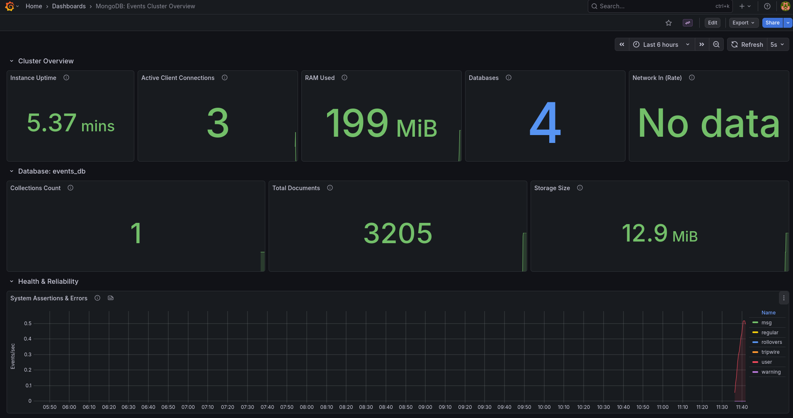
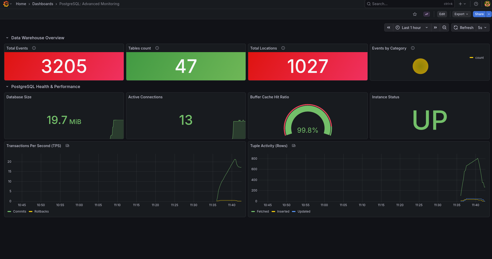
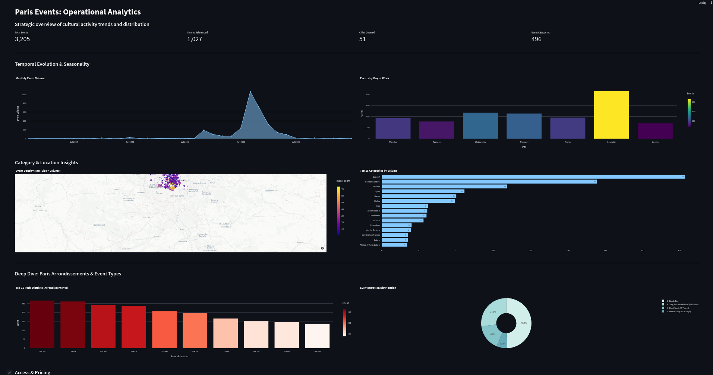
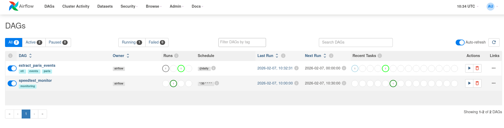

# EventsParis

## Description
**EventsParis** is a robust, production-ready Data Engineering pipeline designed to automate the ingestion, transformation, and analysis of cultural events data from the [Paris OpenData API](https://opendata.paris.fr/). 

The project demonstrates a modern ETL (Extract, Transform, Load) workflow, moving raw JSON data into a Data Lake (MongoDB), processing it for analytical quality, and loading it into a Data Warehouse (PostgreSQL) modeled with a Star Schema for efficient business intelligence querying.

## Architecture
The system is built on a containerized microservices architecture:
- **Ingestion**: Python scripts extract data from public APIs.
- **Data Lake**: **MongoDB** stores raw, unstructured event data.
- **Data Warehouse**: **PostgreSQL** serves as the analytical layer.
- **Orchestration**: **Apache Airflow** schedules and monitors workflows.
- **Monitoring**: **Prometheus** (Metrics) & **Grafana** (Visualization).

## CI/CD & Quality Assurance
- **GitHub Actions**: Automated CI pipeline runs on every push (tests, linting, build checks).
- **Containerization**: Docker ensures reproducible environments across all stages.
- **Testing**: Automated tests validate ETL logic and data integrity (`tests/` directory).
- **Monitoring**: Continuous monitoring with Prometheus alerts and Grafana dashboards.
- **Logging**: Centralized logging from Airflow and application scripts for auditing.
- **Health Checks**: Automatic service health validation between components.

## Prerequisites
Before you begin, ensure you have the following installed on your machine:
- [Git](https://git-scm.com/)
- [Docker](https://www.docker.com/)
- [Docker Compose](https://docs.docker.com/compose/)

## Installation & Setup

### 1. Clone the Repository
```bash
git clone https://github.com/AllaniF/EventsParis.git
cd EventsParis
```

### 2. Configure Environment Variables
The project relies on environment variables for secure configuration. Create a `.env` file in the root directory:

```bash
touch .env
```

Add the following configuration to your `.env` file:

```dotenv
AIRFLOW_UID=50000

# MongoDB Configuration
MONGO_HOST=mongodb
MONGO_PORT=27017
MONGO_USER=admin
MONGO_PASSWORD=password
MONGO_DB=events_db

# Postgres Configuration
POSTGRES_HOST=postgres
POSTGRES_PORT=5432
POSTGRES_USER=airflow
POSTGRES_PASSWORD=airflow
POSTGRES_DB=airflow

# Grafana Configuration
GRAFANA_ADMIN_USER=admin
GRAFANA_ADMIN_PASSWORD=admin

# Airflow Security
AIRFLOW_SECRET_KEY=change_this_to_a_secure_random_string
```

## Running the Project

### 1. Start the Services
Launch all the containers (Airflow, Postgres, MongoDB, Kafka, Prometheus, Grafana) using Docker Compose:

```bash
docker-compose up -d
```

This command will start the following services:
- **PostgreSQL**: Port 5433 (mapped to 5432 inside container)
- **MongoDB**: Port 27017
- **Airflow Webserver**: Port 8080
- **Airflow Scheduler**: Background service
- **Streamlit App**: Port 8501
- **Prometheus**: Port 9090
- **Grafana**: Port 3000

> **⚠️ Important (First Run):** Please **wait a few minutes** after starting the containers before accessing the **Airflow UI**. The initial setup (database migrations and admin user creation) takes some time. Ensure Docker has fully finished initialization before attempting to connect.

### 2. Verify Services
Check if all containers are running:
```bash
docker-compose ps
```

## Monitoring & Visualization

The project includes comprehensive dashboards for both infrastructure monitoring and business intelligence.

### Infrastructure Monitoring (Grafana)
Grafana is used to monitor the health of the databases.
- **URL**: [http://localhost:3000](http://localhost:3000)

#### MongoDB Dashboard
Monitors the Data Lake health (uptime, connections, RAM, storage).



#### PostgreSQL Performance
Monitors the Data Warehouse performance (transactions, cache hit ratios).



### Business Intelligence (Streamlit)
A custom Streamlit application is deployed to visualize the processed events data.
- **URL**: [http://localhost:8501](http://localhost:8501)
- **Features**: Interactive map of events, category filtering, and temporal statistics.



## Accessing the Interfaces

| Service | URL | Default Credentials |
|---------|-----|---------------------|
| **Apache Airflow** | [http://localhost:8080](http://localhost:8080) | `admin` / `admin` |
| **Grafana** | [http://localhost:3000](http://localhost:3000) | `admin` / `admin` |
| **Streamlit App** | [http://localhost:8501](http://localhost:8501) | *(None)* |
| **Prometheus** | [http://localhost:9090](http://localhost:9090) | *(None)* |

## Project Structure

```
EventsParis/
├── airflow/                # Airflow configuration and DAGs
│   ├── dags/               # Directed Acyclic Graphs
│   ├── logs/               # Airflow logs
│   └── plugins/            # Airflow plugins
├── sql/                    # SQL scripts
│   └── init_dw.sql         # Data Warehouse initialization script
├── src/                    # Source code for ETL scripts
│   ├── extract.py          # Script to extract data from API to MongoDB
│   ├── transform_load.py   # Script to transform and load data to PostgreSQL
│   └── eda.ipynb           # Jupyter Notebook for Exploratory Data Analysis
├── tests/
│   └── verify_mongo_connection.py # Utility to check MongoDB connection
├── prometheus/             # Prometheus configuration
├── grafana/                # Grafana provisioning
├── docker-compose.yml      # Docker services configuration
├── Dockerfile              # Custom Docker image definition
├── requirements.txt        # Python dependencies
└── README.md               # Project documentation
```

## Exploratory Data Analysis (EDA)
The project includes a Jupyter Notebook (`src/eda.ipynb`) containing a preliminary analysis of the Paris Events dataset. This notebook documents:
- **Data Profiling**: Understanding the JSON structure and key fields.
- **Data Quality Assessment**: Identification of missing values and formatting issues (e.g., HTML tags in descriptions).
- **Visualization**: Initial exploration of event categories and temporal patterns to inform the Data Warehouse schema design.

## Usage

### Automated Workflow (Airflow)
The primary way to run the ETL process is through Apache Airflow.
1. Access the Airflow UI at [http://localhost:8080](http://localhost:8080).
2. Login with `admin` / `admin`.
3. Trigger the DAG (e.g., `extract_events_dag`) to start the pipeline.



### Manual Execution (Local)
If you wish to run the scripts manually (ensure dependencies are installed via `pip install -r requirements.txt`):

**1. Extract Data**
Fetch data from the OpenData Paris API and store it in MongoDB:
```bash
python src/extract.py
```

**2. Transform & Load**
Process data from MongoDB and load it into PostgreSQL:
```bash
python src/transform_load.py
```

## Database Credentials

- **PostgreSQL**:
  - User: `airflow`
  - Password: `airflow`
  - Database: `airflow`
  - Port: `5433` (Host), `5432` (Container)

- **MongoDB**:
  - User: `admin`
  - Password: `password`
  - Port: `27017`


## Contributors
    - Fadia ALLANI
    - Angie Pineda 